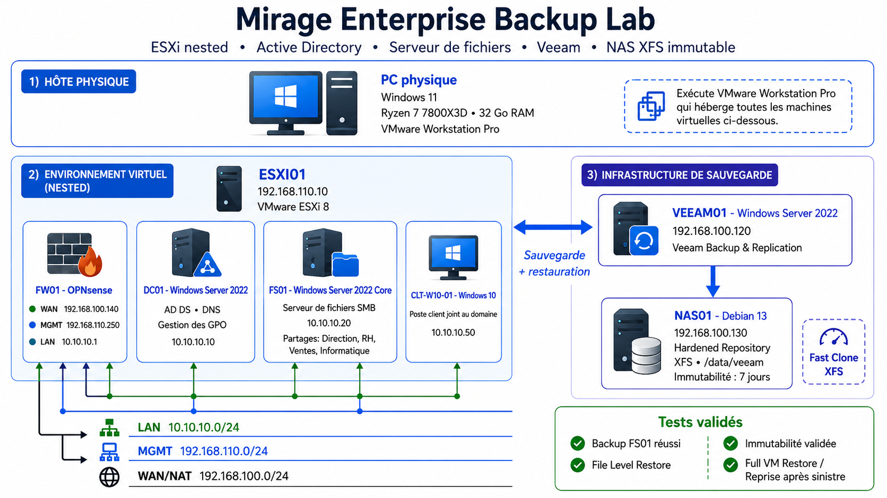

# 01 - Architecture réseau et virtualisation

## Objectif

L'objectif de cette première partie est de construire une infrastructure virtualisée permettant de séparer les différents rôles du lab et de reproduire une architecture proche d'un environnement d'entreprise.

Le lab repose sur **VMware Workstation Pro** installé sur le poste physique.

Une VM **VMware ESXi 8** est utilisée en nested virtualization afin d'héberger l'infrastructure principale, tandis que les composants de sauvegarde sont volontairement placés en dehors de l'hyperviseur ESXi.

---

## Architecture générale

Le lab est organisé autour de trois éléments principaux :

- **ESXI01** : hyperviseur hébergeant les VM de production ;
- **VEEAM01** : serveur Veeam Backup & Replication ;
- **NAS01** : serveur Debian utilisé comme Hardened Repository.

VEEAM01 et NAS01 sont exécutés directement dans VMware Workstation et ne sont donc pas hébergés dans ESXI01.

Cette séparation permet de conserver l'infrastructure de sauvegarde indépendante des machines virtuelles hébergées sur ESXI01 et disponible lors d'une perte de ces dernières.



---

## ESXi

L'hyperviseur utilisé est :

| Paramètre | Valeur |
|---|---|
| Nom | ESXI01 |
| Hyperviseur | VMware ESXi 8 |
| Type | Nested virtualization |
| Adresse de management | 192.168.110.10/24 |
| RAM allouée | 16 Go |
| vCPU | 6 |

ESXI01 héberge les machines virtuelles suivantes :

| VM | Rôle | Adresse IP |
|---|---|---|
| FW01 | Firewall / routeur OPNsense | Plusieurs interfaces |
| DC01 | Active Directory / DNS | 10.10.10.10 |
| FS01 | Serveur de fichiers Windows Server 2022 Core | 10.10.10.20 |
| CLT-W10-01 | Poste client Windows 10 | 10.10.10.50 |

---

## Réseau virtuel ESXi

La connectivité d'ESXI01 repose sur plusieurs commutateurs virtuels et groupes de ports afin de séparer les différents réseaux du lab.

La logique générale est la suivante :

```text
vSwitch0
├── Management Network
└── PG-MGMT

vSwitch-WAN
└── PG-WAN

vSwitch-LAN
└── PG-LAN
```

Les interfaces réseau de la VM OPNsense sont connectées aux groupes de ports correspondants afin d'assurer le routage entre les différents segments.

---

## Segmentation réseau

Trois réseaux principaux sont utilisés dans le lab.

### LAN

```text
10.10.10.0/24
```

Ce réseau héberge les serveurs et le poste client du domaine Active Directory.

| Machine | Adresse |
|---|---|
| FW01 - LAN | 10.10.10.1 |
| DC01 | 10.10.10.10 |
| FS01 | 10.10.10.20 |
| CLT-W10-01 | 10.10.10.50 |

La passerelle utilisée par les machines du LAN est l'interface LAN d'OPNsense :

```text
10.10.10.1
```

Le serveur DNS utilisé par les machines du domaine est :

```text
10.10.10.10
```

Il correspond à DC01.

---

### Management

```text
192.168.110.0/24
```

Ce réseau est dédié à l'administration de l'hyperviseur ESXi.

| Machine / Interface | Adresse |
|---|---|
| ESXI01 | 192.168.110.10 |
| FW01 - MGMT | 192.168.110.250 |

La passerelle IPv4 d'ESXI01 est :

```text
192.168.110.250
```

Cette interface permet à ESXI01 de communiquer avec les autres réseaux en passant par OPNsense.

ESXI01 peut notamment :

- joindre le serveur DNS Active Directory ;
- résoudre les noms internes ;
- résoudre les noms Internet ;
- accéder aux serveurs NTP externes.

---

### WAN / VMware NAT

```text
192.168.100.0/24
```

Ce réseau correspond au réseau NAT de VMware Workstation.

Il assure l'accès vers l'extérieur et héberge également les composants de sauvegarde qui restent séparés d'ESXI01.

| Machine / Interface | Adresse |
|---|---|
| FW01 - WAN | 192.168.100.140 |
| VEEAM01 | 192.168.100.120 |
| NAS01 | 192.168.100.130 |

VEEAM01 et NAS01 sont donc placés sur le même réseau externe que l'interface WAN d'OPNsense, mais sont exécutés directement dans VMware Workstation.

---

## OPNsense

La VM **FW01** utilise OPNsense comme firewall et routeur de l'infrastructure.

Ses interfaces sont :

| Interface | Adresse |
|---|---|
| LAN | 10.10.10.1/24 |
| MGMT | 192.168.110.250/24 |
| WAN | 192.168.100.140/24 |

OPNsense assure notamment :

- le routage entre les réseaux du lab ;
- l'accès du LAN vers l'extérieur ;
- l'accès du réseau de management aux ressources nécessaires ;
- le filtrage des communications inter-réseaux ;
- l'accès d'ESXI01 au serveur DNS Active Directory ;
- l'accès d'ESXI01 aux serveurs NTP externes.

Les règles firewall sont limitées aux flux nécessaires.

Par exemple, ESXI01 dispose des flux nécessaires pour joindre le DNS de DC01 et les serveurs NTP externes :

```text
ESXI01
192.168.110.10
        │
        ├── DNS TCP/UDP 53
        │       ↓
        │     DC01
        │   10.10.10.10
        │
        └── NTP UDP 123
                ↓
          Serveur NTP externe
```

---

## Configuration TCP/IP d'ESXI01

La pile TCP/IP de management d'ESXI01 utilise les paramètres suivants :

```text
Hostname        : ESXI01
Management IP   : 192.168.110.10/24
Gateway         : 192.168.110.250
DNS             : 10.10.10.10
```

Le nom complet de l'hôte est :

```text
ESXI01.mirage-lab.cloud
```

La résolution DNS est assurée par DC01.

---

## Validation du DNS

Plusieurs tests ont été réalisés depuis ESXI01.

Résolution d'une ressource interne :

```bash
nslookup dc01.ad.mirage-lab.cloud
```

Résultat obtenu :

```text
Server:  10.10.10.10
Address: 10.10.10.10:53

Name:    dc01.ad.mirage-lab.cloud
Address: 10.10.10.10
```

La résolution Internet a également été testée :

```bash
nslookup google.com
```

Les résolutions interne et externe sont fonctionnelles.

Le chemin logique est donc :

```text
ESXI01
192.168.110.10
        │
        ▼
FW01 - MGMT
192.168.110.250
        │
        ▼
DC01 - DNS
10.10.10.10
```

---

## Synchronisation NTP d'ESXI01

La synchronisation temporelle est importante dans une infrastructure virtualisée, notamment pour :

- les journaux ;
- l'authentification ;
- les certificats ;
- la corrélation des événements ;
- la cohérence temporelle de l'infrastructure.

ESXI01 utilise le serveur NTP :

```text
ntp.obspm.fr
```

Le trafic NTP en UDP/123 est autorisé depuis le réseau de management.

La configuration a été vérifiée avec :

```bash
esxcli system ntp get
```

Résultat final :

```text
Enabled: true
Servers: ntp.obspm.fr
Service Providing Kernel Time: Network Time Protocol
Time Service Enabled: true
Time Synchronized: true
```

Le fonctionnement a également été contrôlé avec :

```bash
ntpq -pn
```

La synchronisation NTP d'ESXI01 est donc opérationnelle.

---

## Infrastructure de sauvegarde séparée

L'un des choix importants du lab est de ne pas héberger VEEAM01 et NAS01 dans ESXI01.

Ils sont exécutés directement dans VMware Workstation Pro et restent donc indépendants des machines virtuelles hébergées par l'hyperviseur ESXi.

En cas de perte complète des VM hébergées sur ESXI01 :

```text
ESXI01
   ✗
   │
   └── VM de production indisponibles

VEEAM01
   ✓

NAS01
   ✓
```

Les sauvegardes restent alors accessibles depuis l'infrastructure Veeam afin de permettre la restauration des machines virtuelles.

Cette séparation reste toutefois **logique et non physique**, puisque l'ensemble du lab fonctionne sur le même ordinateur hôte. Cette limite est détaillée dans le README avec la règle de sauvegarde 3-2-1.

Cette logique sera exploitée dans les parties consacrées à Veeam et au Linux Hardened Repository.

---

## Tests de connectivité

En complément des validations DNS et NTP précédentes, les principaux flux nécessaires à la future infrastructure de sauvegarde ont été contrôlés.

### ESXI01 vers OPNsense

```bash
vmkping 192.168.110.250
```

Ce test permet de vérifier la connectivité entre l'interface de management d'ESXI01 et sa passerelle OPNsense.

### VEEAM01 vers NAS01

Depuis VEEAM01 :

```powershell
Test-NetConnection 192.168.100.130 -Port 22
```

Lors du déploiement initial du repository Linux :

```text
TcpTestSucceeded : True
```

Le port SSH n'a été utilisé que pour le déploiement initial des composants Veeam sur NAS01.

### VEEAM01 vers ESXI01

```powershell
Test-NetConnection 192.168.110.10 -Port 443
```

Résultat :

```text
TcpTestSucceeded : True
```

Ces tests confirment que VEEAM01 peut communiquer avec l'hyperviseur et le repository tout en restant hébergé en dehors d'ESXI01.

---

## Résultat de cette étape

À l'issue de cette partie :

- VMware ESXi fonctionne en nested virtualization ;
- les VM principales sont hébergées dans ESXI01 ;
- les réseaux LAN, MGMT et WAN/NAT sont séparés ;
- OPNsense assure le routage et le filtrage ;
- ESXI01 utilise DC01 comme serveur DNS ;
- la résolution DNS interne fonctionne ;
- la résolution DNS externe fonctionne ;
- ESXI01 est synchronisé avec un serveur NTP externe ;
- VEEAM01 peut joindre ESXI01 ;
- VEEAM01 peut joindre NAS01 ;
- l'infrastructure de sauvegarde reste indépendante d'ESXI01.

Cette architecture constitue la base des services Active Directory, du serveur de fichiers et de la solution de sauvegarde développés dans les étapes suivantes.

---

## Suite

La prochaine partie détaille la mise en place de l'annuaire Active Directory et du modèle de gestion des permissions AGDLP :

➡️ [02 - Active Directory et modèle AGDLP](02-active-directory-agdlp.md)
