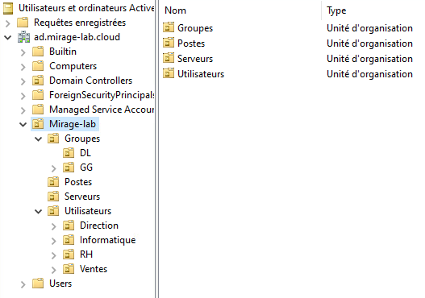
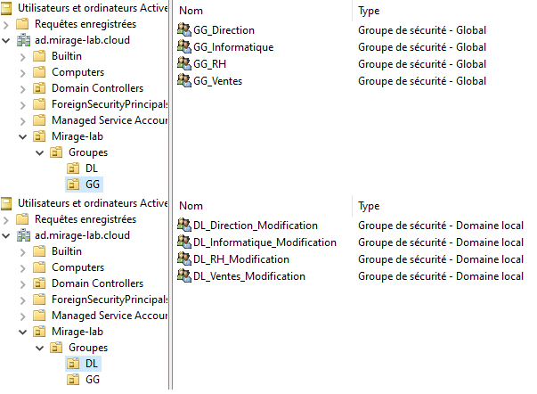
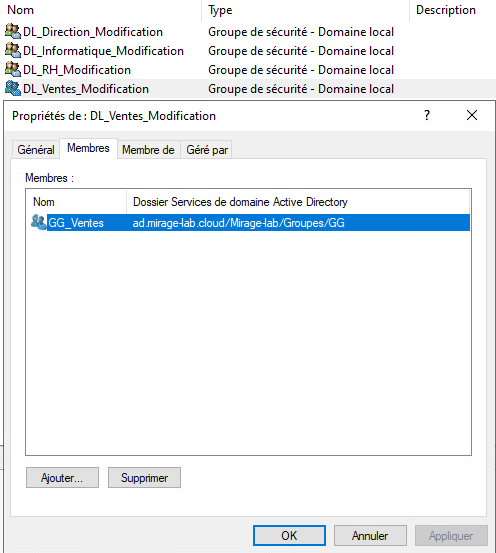
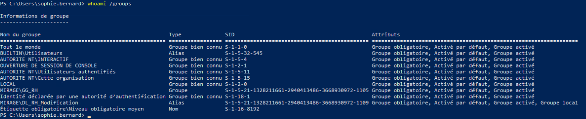

# 02 - Active Directory et modèle AGDLP

## Objectif

Cette partie du lab concerne la mise en place de l'annuaire **Active Directory** et l'organisation des utilisateurs et des groupes de sécurité.

L'objectif est de reproduire une méthode de gestion des identités et des permissions proche de celle utilisée en entreprise, en séparant :

- les comptes utilisateurs ;
- les services de l'entreprise ;
- les groupes représentant les fonctions métier ;
- les groupes donnant accès aux ressources ;
- les permissions appliquées aux serveurs.

Le modèle **AGDLP** est utilisé pour organiser les droits de manière structurée et évolutive.

---

## Domaine Active Directory

Le domaine utilisé dans le lab est :

```text
ad.mirage-lab.cloud
```

Le nom NetBIOS associé est :

```text
MIRAGE
```

Le contrôleur de domaine principal est :

| Paramètre | Valeur |
|---|---|
| Serveur | DC01 |
| Système | Windows Server 2022 |
| Adresse IP | 10.10.10.10 |
| Rôles principaux | AD DS / DNS |

DC01 assure donc l'authentification des utilisateurs et la résolution DNS interne du domaine.

---

## Organisation de l'annuaire

Une OU principale a été créée afin de regrouper les objets du lab :

```text
Mirage-lab
```

L'arborescence retenue est :

```text
Mirage-lab
│
├── Utilisateurs
│   ├── Direction
│   ├── RH
│   ├── Ventes
│   └── Informatique
│
├── Groupes
│   ├── GG
│   └── DL
│
├── Postes
│
└── Serveurs
```

Cette organisation permet de séparer clairement les différents types d'objets Active Directory.

### Structure des OU

La structure mise en place est visible ci-dessous :



Cette organisation facilite l'application des stratégies de groupe et permet de conserver une arborescence lisible lorsque l'infrastructure évolue.

---

## OU Utilisateurs

Les comptes utilisateurs sont organisés selon leur service.

```text
Utilisateurs
├── Direction
├── RH
├── Ventes
└── Informatique
```

Cette organisation facilite notamment :

- l'application de GPO par service ;
- l'administration des comptes ;
- la délégation éventuelle de certaines tâches ;
- la lisibilité de l'annuaire.

Par exemple, les utilisateurs du service RH sont placés dans :

```text
Mirage-lab
└── Utilisateurs
    └── RH
```

et les utilisateurs de la Direction dans :

```text
Mirage-lab
└── Utilisateurs
    └── Direction
```

---

## OU Postes et Serveurs

Les ordinateurs et les serveurs membres du domaine sont également séparés.

### Postes clients

Le poste :

```text
CLT-W10-01
```

est placé dans :

```text
Mirage-lab
└── Postes
```

### Serveurs

Le serveur de fichiers :

```text
FS01
```

est placé dans :

```text
Mirage-lab
└── Serveurs
```

Cette séparation permet d'appliquer ultérieurement des stratégies différentes aux postes utilisateurs et aux serveurs.

---

# Modèle AGDLP

## Principe

Le modèle AGDLP signifie :

```text
A → G → DL → P
```

avec :

```text
A  = Accounts
G  = Global Groups
DL = Domain Local Groups
P  = Permissions
```

Dans le lab, la logique est donc :

```text
Utilisateur
    ↓
Groupe Global métier
    ↓
Groupe Domain Local associé à une ressource
    ↓
Permission sur la ressource
```

Cette approche évite d'attribuer directement des permissions à chaque utilisateur.

---

## Pourquoi utiliser AGDLP ?

Une attribution directe des droits fonctionnerait techniquement :

```text
Alice Martin
    ↓
D:\Partages\Direction
    ↓
Modification
```

mais cette méthode devient rapidement difficile à administrer.

Avec AGDLP :

```text
Alice Martin
    ↓
GG_Direction
    ↓
DL_Direction_Modification
    ↓
D:\Partages\Direction
    ↓
Modification
```

La gestion des utilisateurs et la gestion des ressources sont ainsi séparées.

Si une nouvelle personne rejoint la Direction, il suffit de l'ajouter à :

```text
GG_Direction
```

Les permissions sur le serveur de fichiers n'ont pas besoin d'être modifiées.

---

# Groupes globaux

Les groupes globaux représentent l'appartenance métier des utilisateurs.

Les groupes créés sont :

```text
GG_Direction
GG_RH
GG_Ventes
GG_Informatique
```

Ils sont stockés dans :

```text
Mirage-lab
└── Groupes
    └── GG
```

Un utilisateur est ajouté au groupe correspondant à son service.

Exemple :

```text
Alice Martin
    ↓
GG_Direction
```

ou :

```text
Utilisateur RH
    ↓
GG_RH
```

Le groupe global représente donc essentiellement :

> Qui fait partie du service ?

---

# Groupes Domain Local

Les groupes Domain Local représentent les permissions sur une ressource.

Les groupes créés sont :

```text
DL_Direction_Modification
DL_RH_Modification
DL_Ventes_Modification
DL_Informatique_Modification
```

Ils sont stockés dans :

```text
Mirage-lab
└── Groupes
    └── DL
```

Leur rôle est différent de celui des groupes globaux.

Ils représentent :

> Quel niveau d'accès est accordé sur une ressource ?

Dans ce lab, le niveau utilisé est principalement :

```text
Modification
```

### Groupes de sécurité créés

La séparation entre les groupes globaux et les groupes Domain Local est visible directement dans Active Directory :



Les groupes `GG_*` représentent l'appartenance métier, tandis que les groupes `DL_*` sont associés aux permissions sur les ressources.

---

## Imbrication des groupes

Les groupes globaux ont été ajoutés comme membres des groupes Domain Local correspondants.

La configuration est donc :

```text
GG_Direction
    ↓
DL_Direction_Modification
```

```text
GG_RH
    ↓
DL_RH_Modification
```

```text
GG_Ventes
    ↓
DL_Ventes_Modification
```

```text
GG_Informatique
    ↓
DL_Informatique_Modification
```

Ce sont ensuite les groupes `DL_*` qui sont utilisés pour attribuer les permissions sur les ressources.

### Vérification de l'imbrication

L'imbrication a été vérifiée directement dans les propriétés des groupes Active Directory.

L'exemple ci-dessous montre que `GG_Ventes` est bien membre de `DL_Ventes_Modification` :



Cette relation matérialise la partie `G → DL` du modèle AGDLP.

---

# Exemple complet : Direction

La chaîne complète pour un utilisateur de la Direction est :

```text
Compte utilisateur
        │
        ▼
GG_Direction
        │
        ▼
DL_Direction_Modification
        │
        ▼
\\FS01\Direction
        │
        ▼
Modification
```

L'utilisateur ne reçoit donc aucune permission directement sur le dossier.

Cette méthode permet de conserver une gestion propre même si le nombre d'utilisateurs ou de ressources augmente.

---

# Exemple complet : RH

Le même principe est appliqué au service RH :

```text
Compte utilisateur RH
        │
        ▼
GG_RH
        │
        ▼
DL_RH_Modification
        │
        ▼
\\FS01\RH
        │
        ▼
Modification
```

Les permissions du serveur de fichiers sont donc indépendantes des utilisateurs individuels.

---

## Vérification des groupes depuis un poste client

La présence des groupes dans le jeton de sécurité d'un utilisateur a été vérifiée avec :

```powershell
whoami
```

puis :

```powershell
whoami /groups
```

Par exemple, pour un utilisateur de la Direction, le jeton contient notamment :

```text
MIRAGE\GG_Direction
```

ainsi que le groupe Domain Local associé après résolution de l'imbrication :

```text
MIRAGE\DL_Direction_Modification
```

Pour un utilisateur RH, on retrouve de la même manière :

```text
MIRAGE\GG_RH
MIRAGE\DL_RH_Modification
```



La présence de `GG_RH` et de `DL_RH_Modification` dans le jeton de sécurité confirme que l'imbrication AGDLP est correctement prise en compte lors de l'ouverture de session.

---

# Intégration des machines au domaine

Les machines Windows utilisées dans le lab ont été intégrées au domaine :

```text
ad.mirage-lab.cloud
```

Le serveur de fichiers est membre du domaine :

```text
FS01
```

Le poste client est également membre du domaine :

```text
CLT-W10-01
```

Le poste client a notamment été ajouté avec PowerShell à l'aide de :

```powershell
Add-Computer
```

Après redémarrage, les utilisateurs du domaine peuvent ouvrir une session sous la forme :

```text
MIRAGE\utilisateur
```

ou :

```text
utilisateur@ad.mirage-lab.cloud
```

---

## Exemple de session utilisateur

La session d'un utilisateur du domaine peut être vérifiée avec :

```powershell
whoami
```

Exemple :

```text
mirage\alice.martin
```

Cela permet de confirmer que l'authentification est bien réalisée par Active Directory et non avec un compte local du poste.

---

# Séparation identité / ressource

L'intérêt principal du modèle retenu est la séparation entre deux notions.

### Groupes globaux

Ils représentent les personnes :

```text
GG_Direction
GG_RH
GG_Ventes
GG_Informatique
```

Question associée :

> À quel service appartient l'utilisateur ?

### Groupes Domain Local

Ils représentent l'accès à une ressource :

```text
DL_Direction_Modification
DL_RH_Modification
DL_Ventes_Modification
DL_Informatique_Modification
```

Question associée :

> Quel droit doit être accordé sur cette ressource ?

Cette séparation facilite fortement l'administration.

---

# Exemple d'évolution

Si un nouvel utilisateur rejoint le service RH :

```text
Nouvel utilisateur
       ↓
GG_RH
```

aucune modification n'est nécessaire sur FS01.

Le groupe `GG_RH` étant déjà membre de :

```text
DL_RH_Modification
```

et ce dernier disposant déjà des permissions nécessaires sur :

```text
\\FS01\RH
```

le nouvel utilisateur hérite automatiquement des droits prévus pour son service.

---

# Avantages de l'organisation retenue

Cette architecture Active Directory apporte plusieurs avantages :

- organisation claire des utilisateurs ;
- séparation des postes et des serveurs ;
- possibilité d'appliquer des GPO par OU ;
- absence de permissions directement attribuées aux utilisateurs ;
- gestion centralisée des appartenances métier ;
- gestion centralisée des permissions sur les ressources ;
- ajout ou retrait d'un utilisateur simplifié ;
- meilleure lisibilité des ACL ;
- architecture facilement extensible.

---

# Validation

À l'issue de cette étape :

- le domaine `ad.mirage-lab.cloud` est opérationnel ;
- DC01 fournit Active Directory et DNS ;
- les OU sont structurées par type d'objet et par service ;
- les utilisateurs sont placés dans leurs OU respectives ;
- les groupes globaux représentent les services ;
- les groupes Domain Local représentent les droits sur les ressources ;
- les groupes globaux sont imbriqués dans les groupes Domain Local ;
- FS01 est membre du domaine ;
- CLT-W10-01 est membre du domaine ;
- les appartenances de groupes sont visibles dans les jetons utilisateurs.

Le modèle de permissions peut être résumé ainsi :

```text
Accounts
   ↓
Global Groups
   ↓
Domain Local Groups
   ↓
Permissions
```

Cette structure sera utilisée dans la partie suivante pour appliquer concrètement les permissions NTFS et SMB sur le serveur de fichiers FS01.

---

## Suite

La prochaine partie détaille la configuration du serveur de fichiers, des permissions SMB/NTFS et des GPO utilisées dans le lab :

➡️ [03 - Serveur de fichiers et GPO](03-serveur-fichiers-gpo.md)
