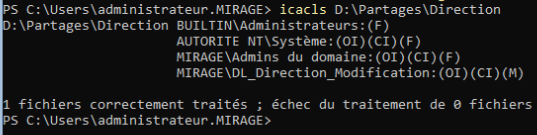
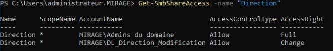
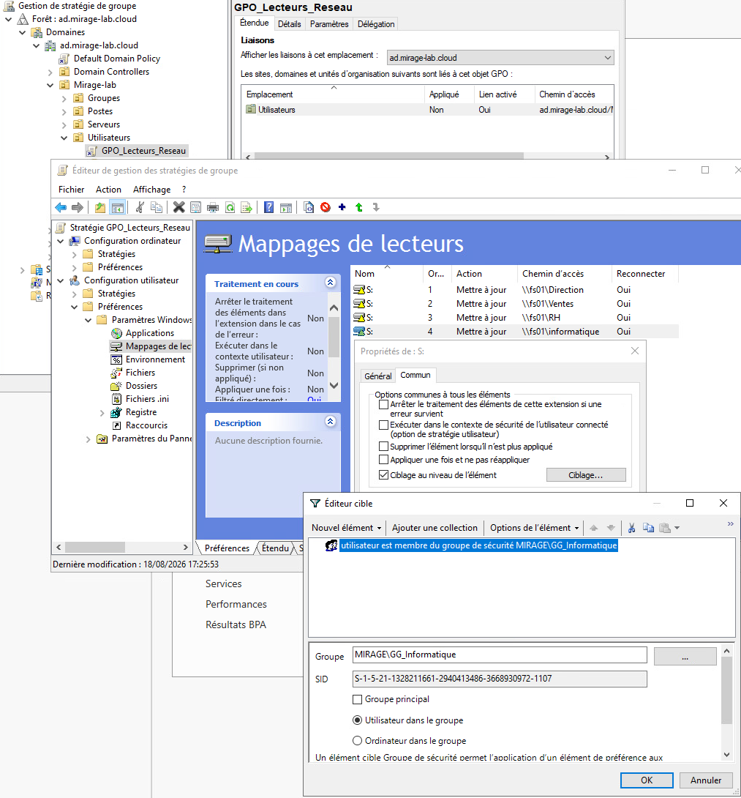
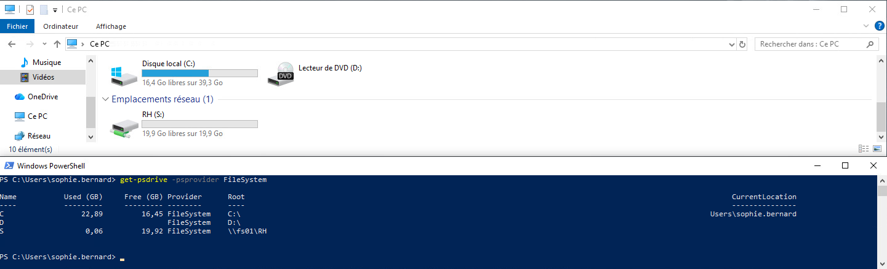
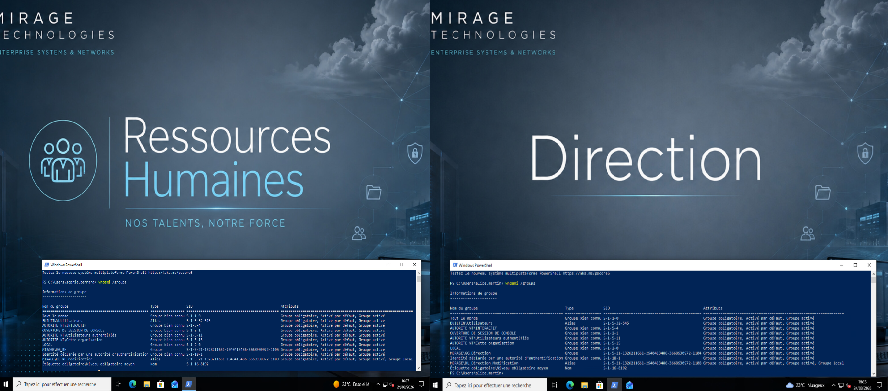

# 03 - Serveur de fichiers et GPO

## Objectif

Cette partie du lab consiste à mettre en place un serveur de fichiers centralisé et à appliquer concrètement le modèle AGDLP préparé dans Active Directory.

Les objectifs sont les suivants :

- utiliser un serveur Windows Server Core dédié au stockage des données ;
- séparer le système d'exploitation des données ;
- créer des espaces de stockage par service ;
- appliquer les permissions à travers les groupes Domain Local ;
- publier les ressources avec SMB ;
- mapper automatiquement les lecteurs réseau avec une GPO ;
- appliquer des paramètres utilisateurs différents selon les OU ;
- valider les droits depuis une véritable session utilisateur du domaine.

---

## Serveur FS01

Le serveur de fichiers utilisé est :

| Paramètre | Valeur |
|---|---|
| Nom | FS01 |
| Système | Windows Server 2022 Core |
| Adresse IP | 10.10.10.20 |
| Domaine | ad.mirage-lab.cloud |
| Rôle | Serveur de fichiers SMB |

FS01 est membre du domaine Active Directory et son objet ordinateur est placé dans :

```text
Mirage-lab
└── Serveurs
    └── FS01
```

L'administration courante du serveur est réalisée avec un compte d'administration du domaine.

La session utilisée peut être vérifiée avec :

```powershell
whoami
```

Exemple :

```text
mirage\administrateur
```

---

## Séparation du système et des données

FS01 possède un disque système ainsi qu'un second disque dédié aux données.

Le volume de données est monté avec la lettre :

```text
D:
```

Le volume a été formaté en NTFS et nommé :

```text
DATA
```

Cette séparation permet de ne pas stocker les données métier directement sur le volume système `C:`.

L'organisation retenue est donc :

```text
C:
└── Windows Server 2022 Core

D:
└── Données et partages
```

---

## Arborescence des données

Une arborescence dédiée a été créée sous :

```text
D:\Partages
```

Elle contient un répertoire par service :

```text
D:\Partages
│
├── Direction
├── RH
├── Ventes
├── Informatique
│
└── Ressources
    └── Wallpaper
```

Les quatre premiers dossiers contiennent les données métier.

Le dossier `Ressources` est utilisé pour les éléments communs nécessaires aux GPO, notamment les fonds d'écran.

---

### Données de test

Quelques fichiers ont été créés afin de pouvoir tester les accès, les sauvegardes et les restaurations.

Exemple d'organisation :

```text
Direction
├── Budget_2026.xlsx
├── Strategie.txt
└── alice.txt

RH
├── employes.xlsx
└── Procédures.txt

Ventes
├── Clients.xlsx
└── Devis.txt

Informatique
├── Inventaire.xlsx
└── Documentation.txt
```

Ces fichiers permettront également de valider ultérieurement les fonctions de restauration Veeam.

---

## Application du modèle AGDLP

Les permissions ne sont pas attribuées directement aux utilisateurs.

Les groupes Domain Local créés précédemment sont utilisés :

```text
DL_Direction_Modification
DL_RH_Modification
DL_Ventes_Modification
DL_Informatique_Modification
```

La chaîne logique est donc :

```text
Utilisateur
    ↓
GG_Service
    ↓
DL_Service_Modification
    ↓
Dossier du service
    ↓
Permission NTFS
```

---

## Permissions NTFS

Les permissions NTFS ont été appliquées sur chaque dossier métier.

Pour le dossier Direction, la logique retenue est par exemple :

```text
D:\Partages\Direction
│
├── SYSTEM
│   └── Contrôle total
│
├── Administrateurs
│   └── Contrôle total
│
├── Admins du domaine
│   └── Contrôle total
│
└── DL_Direction_Modification
    └── Modification
```

Le même principe est appliqué aux autres services.

---

### Exemple avec ICACLS

Les permissions peuvent être contrôlées directement depuis FS01 avec :

```powershell
icacls "D:\Partages\Direction"
```

Un résultat de ce type est attendu :

```text
AUTORITE NT\Système:(OI)(CI)(F)
MIRAGE\Admins du domaine:(OI)(CI)(F)
MIRAGE\DL_Direction_Modification:(OI)(CI)(M)
```

Les indicateurs utilisés signifient notamment :

```text
OI = Object Inherit
CI = Container Inherit
F  = Full Control
M  = Modify
```

Les fichiers et sous-dossiers héritent donc des permissions configurées sur leur dossier métier.

#### Validation des permissions NTFS

La configuration a été vérifiée directement sur FS01 avec `icacls` :



La sortie confirme notamment que `DL_Direction_Modification` dispose du droit `Modification`, avec héritage sur les fichiers et sous-dossiers.

---

### Permissions par service

La logique appliquée est :

| Dossier | Groupe autorisé | Permission NTFS |
|---|---|---|
| Direction | DL_Direction_Modification | Modification |
| RH | DL_RH_Modification | Modification |
| Ventes | DL_Ventes_Modification | Modification |
| Informatique | DL_Informatique_Modification | Modification |

Les utilisateurs ne sont jamais ajoutés directement dans les ACL.

---

## Partages SMB

Une fois les permissions NTFS configurées, chaque dossier a été publié comme partage SMB.

Les partages disponibles sont :

```text
\\FS01\Direction
\\FS01\RH
\\FS01\Ventes
\\FS01\Informatique
```

Les partages peuvent être vérifiés depuis FS01 avec :

```powershell
Get-SmbShare
```

---

### Permissions de partage

Les permissions SMB suivent également le modèle AGDLP.

Pour le partage Direction :

```text
MIRAGE\Admins du domaine
    → Full

MIRAGE\DL_Direction_Modification
    → Change
```

Le même principe est appliqué aux partages RH, Ventes et Informatique avec les groupes `DL_*_Modification` correspondants.

Les permissions peuvent être contrôlées avec :

```powershell
Get-SmbShareAccess -Name "Direction"
```

#### Validation des permissions SMB

La configuration du partage `Direction` a été vérifiée directement depuis FS01 :



Le groupe `MIRAGE\DL_Direction_Modification` dispose du droit `Change`, tandis que les administrateurs du domaine disposent du contrôle total.

---

### NTFS et SMB

Lorsqu'un utilisateur accède à une ressource à travers un partage réseau, deux niveaux de permissions sont appliqués :

```text
Permissions SMB
        +
Permissions NTFS
        ↓
Permissions effectives
```

Lors d'un accès à travers un partage réseau, les permissions SMB et NTFS sont toutes les deux évaluées. Le droit effectif correspond au niveau d'accès le plus restrictif résultant de leur combinaison.

Dans ce lab :

- les permissions SMB donnent `Change` aux groupes `DL_*_Modification` ;
- les permissions NTFS donnent `Modification` aux mêmes groupes.

Cela permet aux utilisateurs autorisés de créer, modifier et supprimer les fichiers de leur propre service.

---

### Validation des permissions utilisateur

Les droits ont été testés depuis `CLT-W10-01` avec des sessions utilisateurs du domaine.

#### Exemple : utilisateur Direction

Depuis une session appartenant au service Direction, l'accès suivant est autorisé :

```text
\\FS01\Direction
```

L'utilisateur peut :

- créer un fichier ;
- écrire dans le fichier ;
- relire son contenu ;
- modifier les données.

En revanche, l'accès aux autres services est refusé :

```text
\\FS01\RH
\\FS01\Ventes
\\FS01\Informatique
```

Le modèle AGDLP est donc effectivement appliqué aux ressources SMB.

---

## GPO de lecteurs réseau

Afin d'éviter aux utilisateurs de saisir manuellement les chemins UNC, une GPO a été créée pour mapper automatiquement leur partage métier.

La stratégie utilisée est :

```text
GPO_Lecteurs_Reseau
```

Elle est appliquée aux utilisateurs du lab.

Tous les services utilisent la même lettre de lecteur :

```text
S:
```

mais le chemin cible dépend du groupe de l'utilisateur.

---

### Mappage par service

La configuration logique est :

| Groupe | Lecteur | Destination |
|---|---|---|
| GG_Direction | S: | \\FS01\Direction |
| GG_RH | S: | \\FS01\RH |
| GG_Ventes | S: | \\FS01\Ventes |
| GG_Informatique | S: | \\FS01\Informatique |

L'utilisateur voit donc toujours :

```text
S:
```

mais le contenu correspond automatiquement à son service.

---

### Item-Level Targeting

Le ciblage est effectué avec **Item-Level Targeting** dans les préférences de stratégie de groupe.

Exemple pour Direction :

```text
Utilisateur membre du groupe :
MIRAGE\GG_Direction
```

La préférence correspondante configure alors :

```text
S:
→ \\FS01\Direction
```

Le même principe est appliqué aux autres services avec leur groupe global et leur chemin UNC respectifs.

Cette méthode évite de créer une GPO différente pour chaque lecteur réseau.

#### Configuration dans la GPO

La GPO contient une préférence de lecteur pour chaque service. Chaque élément utilise la lettre `S:` mais possède un chemin UNC différent et un ciblage basé sur le groupe global correspondant.



L'exemple affiché montre le ciblage du lecteur Informatique sur les utilisateurs membres de `MIRAGE\GG_Informatique`.

---

### Validation du lecteur réseau

Après application de la GPO, le résultat peut être contrôlé avec :

```powershell
Get-PSDrive -PSProvider FileSystem
```

ou :

```cmd
net use
```

#### Validation depuis une session RH

La configuration a été vérifiée depuis la session de Sophie Bernard.



L'Explorateur Windows affiche le lecteur `RH (S:)` et `Get-PSDrive` confirme qu'il pointe vers :

```text
\\FS01\RH
```

Le mappage est donc automatiquement adapté au service de l'utilisateur connecté.

---

## Ressources pour les fonds d'écran

Un partage spécifique a également été créé afin de stocker les ressources utilisées par les GPO.

Le chemin local est :

```text
D:\Partages\Ressources\Wallpaper
```

Le partage SMB associé est :

```text
\\FS01\Wallpaper
```

Contrairement aux dossiers métier, les utilisateurs n'ont besoin que d'un accès en lecture.

Les permissions sont donc différentes :

```text
MIRAGE\Admins du domaine
    → Contrôle total

Utilisateurs authentifiés
    → Lecture
```

Cela permet aux postes clients de récupérer les images sans autoriser leur modification.

---

## GPO de fonds d'écran

Deux fonds d'écran différents ont été utilisés afin de valider le ciblage des GPO par OU.

Les stratégies créées sont :

```text
Wallpaper_Direction
Wallpaper_RH
```

Elles sont liées directement aux OU correspondantes :

```text
Utilisateurs
├── Direction
│   └── Wallpaper_Direction
│
└── RH
    └── Wallpaper_RH
```

Le but n'est pas ici de multiplier les fonds d'écran, mais de démontrer qu'une configuration utilisateur peut être appliquée différemment selon son emplacement dans Active Directory.

### Validation visuelle des GPO

Les deux stratégies ont été testées avec des comptes appartenant à des OU différentes.



À gauche, la session de Sophie Bernard reçoit le fond d'écran **Ressources Humaines**.

À droite, la session d'Alice Martin reçoit le fond d'écran **Direction**.

Cette validation confirme que les paramètres utilisateurs sont correctement appliqués selon l'OU du compte connecté.

---

## Chaîne complète côté utilisateur

L'ensemble des mécanismes mis en place peut être résumé ainsi :

```text
Utilisateur Active Directory
          │
          ▼
       GG_Service
          │
          ▼
DL_Service_Modification
          │
          ▼
Permissions NTFS / SMB
          │
          ▼
      \\FS01\Service
          │
          ▼
      GPO lecteur S:
```

En parallèle :

```text
OU de l'utilisateur
        │
        ▼
GPO utilisateur
        │
        ▼
Fond d'écran du service
```

L'identité, les permissions et la configuration du poste sont donc administrées de manière centralisée.

---

## Validation finale

À l'issue de cette partie :

- FS01 fonctionne sous Windows Server 2022 Core ;
- le système et les données sont séparés ;
- les données métier sont organisées par service ;
- les permissions NTFS utilisent les groupes Domain Local ;
- les partages SMB utilisent les mêmes groupes de ressources ;
- les utilisateurs accèdent uniquement aux ressources autorisées ;
- les accès non autorisés sont refusés ;
- le lecteur `S:` est automatiquement mappé selon le groupe métier ;
- le ciblage est réalisé avec Item-Level Targeting ;
- les ressources nécessaires aux GPO sont stockées sur FS01 ;
- les fonds d'écran Direction et RH sont appliqués par GPO ;
- l'ensemble a été validé depuis de véritables sessions utilisateurs du domaine.

Cette partie démontre l'utilisation concrète du modèle AGDLP dans une infrastructure Windows.

---

## Suite

La prochaine partie quitte l'infrastructure de production afin de préparer le stockage des sauvegardes.

Elle détaille l'installation de NAS01 sous Debian, la création du volume XFS et la préparation du Linux Hardened Repository :

➡️ [04 - NAS XFS et Hardened Repository](04-nas-xfs-hardened-repository.md)
