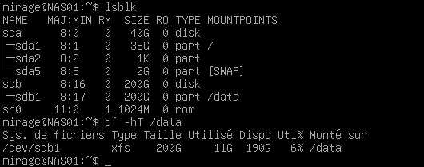
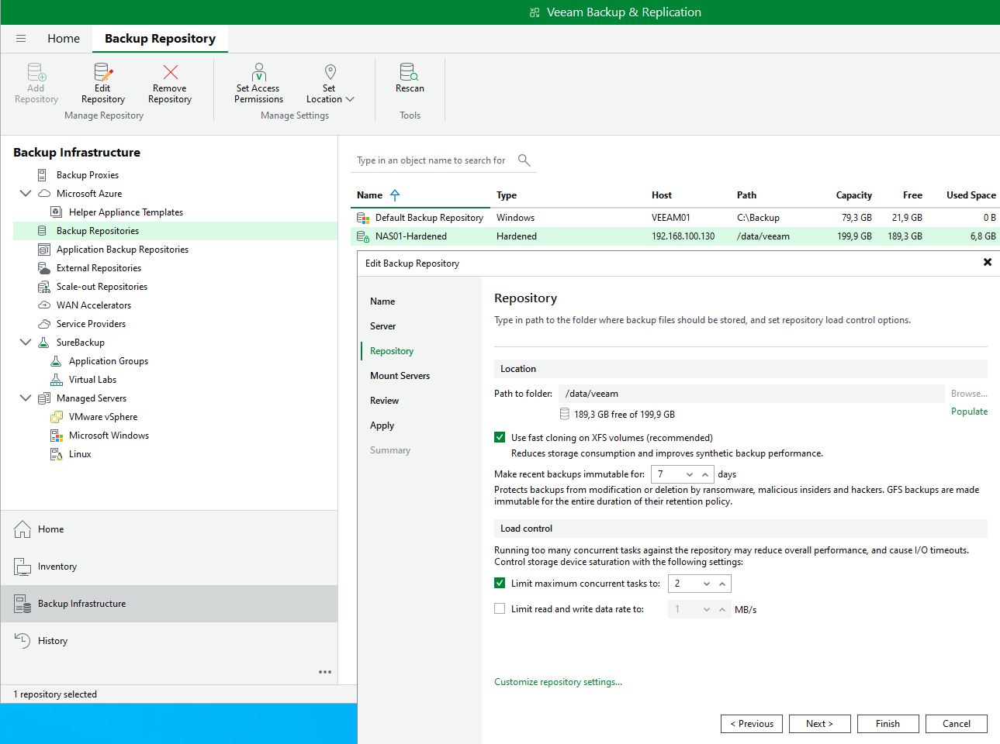
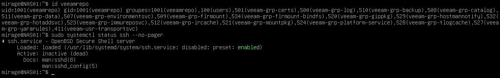

# 04 - NAS XFS et Hardened Repository

## Objectif

Cette partie du lab consiste à mettre en place une infrastructure de stockage dédiée aux sauvegardes Veeam.

L'objectif n'est pas simplement de créer un espace disque accessible à Veeam, mais de construire un **Linux Hardened Repository** séparé de l'hyperviseur ESXi et protégé contre la suppression ou la modification prématurée des sauvegardes.

Les principaux objectifs sont :

- héberger le repository en dehors d'ESXI01 ;
- utiliser un système Linux dédié ;
- conserver le serveur hors du domaine Active Directory ;
- utiliser un volume XFS dédié aux sauvegardes ;
- exploiter Fast Clone ;
- utiliser un compte local dédié à Veeam ;
- utiliser des identifiants à usage unique pour le déploiement ;
- retirer les privilèges administratifs après installation ;
- désactiver SSH après déploiement ;
- rendre les sauvegardes immuables pendant une durée définie.

---

# Séparation de l'infrastructure de sauvegarde

NAS01 n'est pas hébergé dans ESXI01.

Il est exécuté directement dans **VMware Workstation Pro**, au même niveau que VEEAM01.

L'architecture retenue est donc :

```text
VMware Workstation Pro
│
├── ESXI01
│   ├── FW01
│   ├── DC01
│   ├── FS01
│   └── CLT-W10-01
│
├── VEEAM01
│
└── NAS01
```

Ce choix permet d'éviter qu'une perte complète de l'hyperviseur entraîne également la perte du repository de sauvegarde.

En cas de défaillance d'ESXI01 :

```text
ESXI01
   ✗
   │
   └── VM de production indisponibles

VEEAM01
   ✓

NAS01
   ✓
```

Le serveur de sauvegarde et les données nécessaires à la restauration restent donc indépendants de l'hyperviseur protégé.

---

# Serveur NAS01

Le système utilisé pour le repository est Debian.

| Paramètre | Valeur |
|---|---|
| Nom | NAS01 |
| Système | Debian 13 |
| Adresse IP | 192.168.100.130/24 |
| Passerelle | 192.168.100.2 |
| vCPU | 2 |
| RAM | 2 Go |
| Rôle | Linux Hardened Repository |

NAS01 n'est pas membre du domaine Active Directory.

Cette séparation limite la dépendance entre les identités du domaine et l'infrastructure de sauvegarde.

---

## Configuration réseau

L'interface principale utilise une adresse IPv4 statique.

La configuration est définie dans :

```text
/etc/network/interfaces
```

avec la logique suivante :

```text
auto ens33
iface ens33 inet static
    address 192.168.100.130/24
    gateway 192.168.100.2
```

Le hostname du serveur est :

```text
NAS01
```

La configuration peut être vérifiée avec :

```bash
ip a
```

et :

```bash
hostnamectl
```

---

# Organisation du stockage

NAS01 possède deux disques virtuels.

| Disque | Taille | Utilisation |
|---|---:|---|
| `/dev/sda` | 40 Go | Debian |
| `/dev/sdb` | 200 Go | Repository Veeam |

Le disque système reste donc séparé du volume contenant les sauvegardes.

La présence des disques peut être vérifiée avec :

```bash
lsblk -o NAME,SIZE,TYPE,FSTYPE,MOUNTPOINTS
```

La configuration obtenue est de ce type :

```text
sda      40G disk
├─sda1   38G part ext4 /
├─sda2    1K part
└─sda5    2G part swap [SWAP]

sdb     200G disk
└─sdb1  200G part xfs /data
```

---

# Création du volume XFS

Une partition dédiée a été créée sur le second disque :

```text
/dev/sdb1
```

Elle a ensuite été formatée avec le système de fichiers XFS :

```bash
sudo mkfs.xfs /dev/sdb1
```

Le résultat confirme notamment l'utilisation de XFS avec les fonctionnalités modernes du système de fichiers :

```text
crc=1
reflink=1
bigtime=1
```

Le support de `reflink` est particulièrement intéressant pour Veeam, car il permet l'utilisation de **Fast Clone**.

---

# Point de montage

Le volume est monté sous :

```text
/data
```

Le répertoire a été créé avec :

```bash
sudo mkdir -p /data
```

puis le volume monté :

```bash
sudo mount /dev/sdb1 /data
```

La configuration a été vérifiée avec :

```bash
df -hT /data
```

Résultat :

```text
Sys. de fichiers  Type  Taille  Utilisé  Dispo  Monté sur
/dev/sdb1         xfs   200G    3,9G     197G   /data
```

Le système de fichiers XFS est donc correctement monté.

### Validation du stockage XFS

La configuration finale du stockage a été vérifiée avec :

```bash
lsblk
df -hT /data
```



La sortie confirme que le disque dédié de 200 Go est partitionné en `/dev/sdb1`, formaté en **XFS** et monté sous `/data`.

---

# Montage persistant

Afin que le volume soit automatiquement remonté après un redémarrage de NAS01, son UUID a été récupéré avec :

```bash
sudo blkid /dev/sdb1
```

L'UUID du volume est ensuite utilisé dans :

```text
/etc/fstab
```

La configuration a été testée avec :

```bash
sudo umount /data
sudo mount -a
```

Après modification de `fstab`, la configuration systemd a également été rechargée :

```bash
sudo systemctl daemon-reload
```

Une nouvelle vérification avec :

```bash
lsblk
```

confirme :

```text
sdb
└─sdb1  200G  /data
```

Le montage est donc persistant.

---

# Test d'écriture

Avant d'utiliser le volume avec Veeam, une écriture simple a été réalisée :

```bash
sudo touch /data/test.txt
```

puis vérifiée avec :

```bash
ls -l /data
```

Le fichier de test a ensuite été supprimé :

```bash
sudo rm /data/test.txt
```

Cette étape confirme que le volume est correctement accessible en écriture.

---

# Répertoire dédié à Veeam

Un répertoire spécifique a été créé pour recevoir les sauvegardes :

```text
/data/veeam
```

Un compte Linux local dédié a également été créé :

```text
veeamrepo
```

Création du compte :

```bash
sudo adduser veeamrepo
```

Puis création du repository :

```bash
sudo mkdir -p /data/veeam
```

Le propriétaire du répertoire a été modifié :

```bash
sudo chown veeamrepo:veeamrepo /data/veeam
```

et les permissions limitées à ce compte :

```bash
sudo chmod 700 /data/veeam
```

Le résultat est :

```text
drwx------ veeamrepo veeamrepo /data/veeam
```

Seul le compte dédié dispose donc d'un accès direct au répertoire de sauvegarde.

---

# Préparation du compte pour le déploiement Veeam

Pendant la phase initiale de déploiement, le compte `veeamrepo` doit permettre à Veeam d'installer les composants nécessaires sur NAS01.

Le compte a donc temporairement reçu les privilèges nécessaires.

Dans ce lab, il a initialement été ajouté au groupe `sudo` :

```bash
sudo usermod -aG sudo veeamrepo
```

La configuration a été contrôlée avec :

```bash
id veeamrepo
```

Cette élévation n'est conservée que pendant la phase de déploiement.

---

# Ajout de NAS01 dans Veeam

NAS01 a ensuite été ajouté dans **Veeam Backup & Replication** comme serveur Linux.

La connexion initiale utilise SSH :

```text
VEEAM01
192.168.100.120
        │
        │ SSH TCP/22
        ▼
NAS01
192.168.100.130
```

La connectivité avait été validée depuis VEEAM01 avec :

```powershell
Test-NetConnection 192.168.100.130 -Port 22
```

Résultat :

```text
TcpTestSucceeded : True
```

---

# Single-use credentials

Pour le déploiement du Hardened Repository, Veeam utilise l'option :

```text
Single-use credentials for hardened repository
```

Le compte utilisé est :

```text
veeamrepo
```

Ces identifiants servent à réaliser le déploiement initial mais ne sont pas conservés comme des identifiants administratifs permanents utilisables depuis la console.

Cette approche permet de réduire l'exposition d'un compte Linux disposant de privilèges élevés.

---

# Déploiement des composants Veeam

Lors de l'ajout de NAS01, Veeam déploie les composants nécessaires au fonctionnement du repository.

Le processus a notamment installé et configuré :

```text
Installer service
OpenSSL
Veeam Data Mover service
```

Le serveur a ensuite été enregistré correctement dans l'infrastructure Veeam.

Le Data Mover permet les transferts de données nécessaires entre l'infrastructure protégée et le repository.

---

# Création du Hardened Repository

Le repository a été créé dans Veeam avec le type :

```text
Linux (Hardened Repository)
```

Le serveur utilisé est :

```text
NAS01
```

et le chemin :

```text
/data/veeam
```

Veeam détecte automatiquement que `/data` correspond au volume :

```text
/dev/sdb1
```

formaté en XFS.

---

## Paramètres du repository

Le repository créé est nommé :

```text
NAS01-Hardened
```

Les principaux paramètres retenus sont :

| Paramètre | Valeur |
|---|---|
| Serveur | NAS01 |
| Chemin | `/data/veeam` |
| Système de fichiers | XFS |
| Fast Clone | Activé |
| Immutabilité | 7 jours |
| Tâches simultanées maximales | 2 |

Le mount server Windows utilisé est :

```text
VEEAM01
```

### Configuration du Hardened Repository

La configuration finale du repository est visible directement dans Veeam Backup & Replication :



Veeam reconnaît `NAS01-Hardened` comme un repository de type **Hardened** utilisant `/data/veeam`.

La configuration confirme également :

- **Fast Clone sur XFS** activé ;
- **7 jours d'immutabilité** ;
- **2 tâches simultanées maximum**.

---

# Fast Clone avec XFS

Le repository utilise l'option :

```text
Use fast cloning on XFS volumes
```

Fast Clone permet à Veeam d'exploiter les capacités de clonage de blocs du système de fichiers XFS.

Au lieu de recopier physiquement tous les blocs lors de certaines opérations synthétiques, le système de fichiers peut réutiliser les blocs existants.

Cela permet notamment de réduire :

- les écritures physiques ;
- l'espace nécessaire à certaines opérations ;
- le temps de création de sauvegardes synthétiques.

Le volume ayant été créé avec :

```text
reflink=1
```

il est compatible avec ce mécanisme.

---

# Immutabilité

Le repository a été configuré avec :

```text
7 jours d'immutabilité
```

Pendant cette période, les fichiers de sauvegarde protégés ne doivent pas pouvoir être supprimés ou modifiés normalement avant l'expiration de leur verrouillage.

La logique recherchée est :

```text
Backup créé
      │
      ▼
Fichier protégé
      │
      ├── Jour 1
      ├── Jour 2
      ├── ...
      └── Jour 7
              │
              ▼
       Fin de l'immutabilité
```

Cette protection permet notamment de limiter l'impact d'une suppression accidentelle ou d'une compromission du serveur Veeam.

L'immutabilité sera testée concrètement dans une étape ultérieure.

---

# Durcissement après déploiement

Une fois NAS01 enregistré et le Hardened Repository créé, les privilèges temporaires utilisés pour le déploiement ne sont plus nécessaires.

Le compte `veeamrepo` a donc été retiré du groupe `sudo` :

```bash
sudo deluser veeamrepo sudo
```

Une vérification avec :

```bash
id veeamrepo
```

confirme que le compte ne fait plus partie du groupe `sudo`.

Les groupes présents après le déploiement correspondent principalement aux composants Veeam installés sur le serveur.

---

# Désactivation de SSH

SSH était nécessaire pour le déploiement initial.

Une fois les composants Veeam installés et le repository opérationnel, le service SSH a été arrêté et désactivé :

```bash
sudo systemctl disable --now ssh
```

La configuration a été vérifiée avec :

```bash
sudo systemctl status ssh
```

Résultat :

```text
Loaded: loaded
Active: inactive (dead)
```

Le port SSH n'est donc plus exposé en permanence après la phase d'installation.

En cas d'opération de maintenance nécessitant de nouveau SSH, le service pourra être réactivé temporairement puis désactivé une fois l'intervention terminée.

---

### Validation du durcissement

L'état final de NAS01 a été contrôlé après le déploiement du repository :

```bash
id veeamrepo
sudo systemctl status ssh --no-pager
```



Le compte `veeamrepo` ne fait plus partie du groupe `sudo` et le service SSH est arrêté et désactivé après le déploiement.

---

# Principe de durcissement retenu

Le fonctionnement du repository peut être résumé ainsi :

```text
VEEAM01
   │
   │ Déploiement initial
   │ via identifiants à usage unique
   ▼
NAS01
   │
   ├── Debian 13
   ├── hors domaine
   ├── XFS
   ├── /data/veeam
   ├── compte veeamrepo
   ├── sudo retiré après installation
   ├── SSH désactivé
   └── backups immuables 7 jours
```

L'objectif est de réduire le nombre de mécanismes permettant à un attaquant ayant compromis VEEAM01 d'obtenir également un accès administratif persistant au repository Linux.

---

# Vérification du repository

Après sa création, une synchronisation du repository a été réalisée depuis Veeam.

Le résultat indique :

```text
NAS01-Hardened
Backup immutability settings have been synchronized
Backup repositories synchronization completed successfully
```

Le repository est donc reconnu et opérationnel.

À ce stade, aucune sauvegarde n'avait encore été créée.

---

# Chaîne de sauvegarde préparée

L'infrastructure est maintenant prête pour recevoir les sauvegardes :

```text
ESXI01
   │
   │ vSphere API
   ▼
VEEAM01
   │
   │ Veeam Data Mover
   ▼
NAS01-Hardened
   │
   ▼
/data/veeam
   │
   ▼
XFS
   │
   ▼
Immutabilité 7 jours
```

La production, le serveur de sauvegarde et le stockage sont ainsi séparés en plusieurs composants.

---

# Validation finale

À l'issue de cette partie :

- NAS01 fonctionne sous Debian 13 ;
- NAS01 dispose d'une adresse IPv4 statique ;
- le serveur reste hors du domaine Active Directory ;
- le système et le stockage de sauvegarde utilisent des disques séparés ;
- le disque de 200 Go est formaté en XFS ;
- le volume est monté de manière persistante sous `/data` ;
- le repository utilise `/data/veeam` ;
- un compte `veeamrepo` dédié est utilisé ;
- les permissions du repository sont limitées ;
- NAS01 est reconnu par Veeam ;
- les identifiants utilisés pour le déploiement sont à usage unique ;
- Fast Clone est activé ;
- les sauvegardes sont configurées pour être immuables pendant 7 jours ;
- `veeamrepo` a été retiré du groupe `sudo` après le déploiement ;
- SSH a été désactivé après l'installation ;
- le Hardened Repository est prêt à recevoir les jobs de sauvegarde.

Le repository peut désormais être utilisé pour sauvegarder les machines virtuelles hébergées sur ESXI01.

---

## Suite

La prochaine partie détaille la configuration du job Veeam, le premier backup de FS01 et la restauration granulaire d'un fichier :

➡️ [05 - Veeam Backup et restauration](05-veeam-backup-restore.md)
