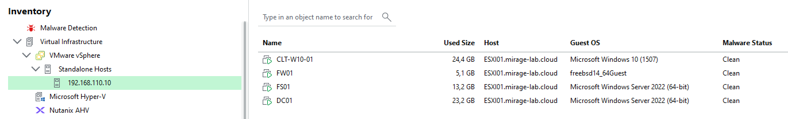
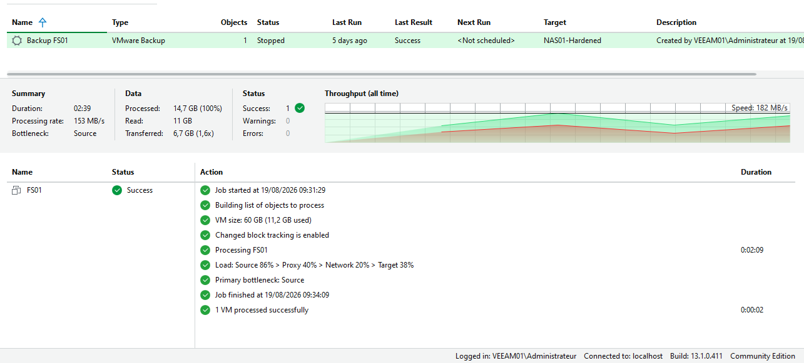
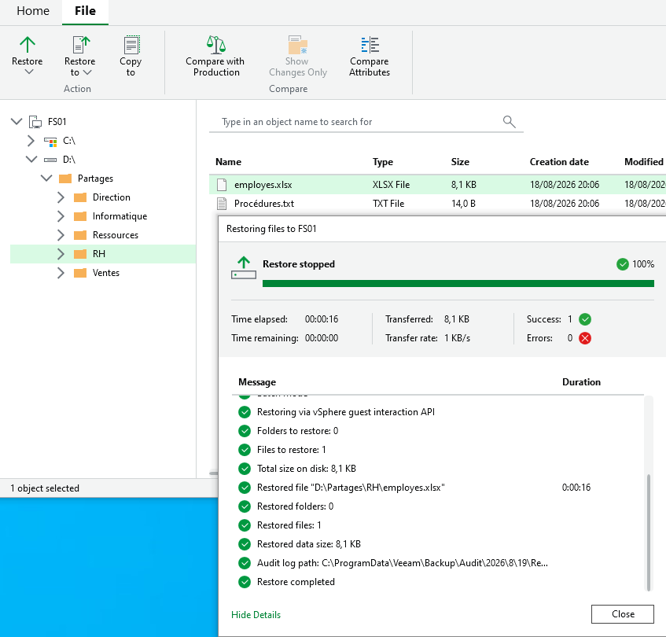
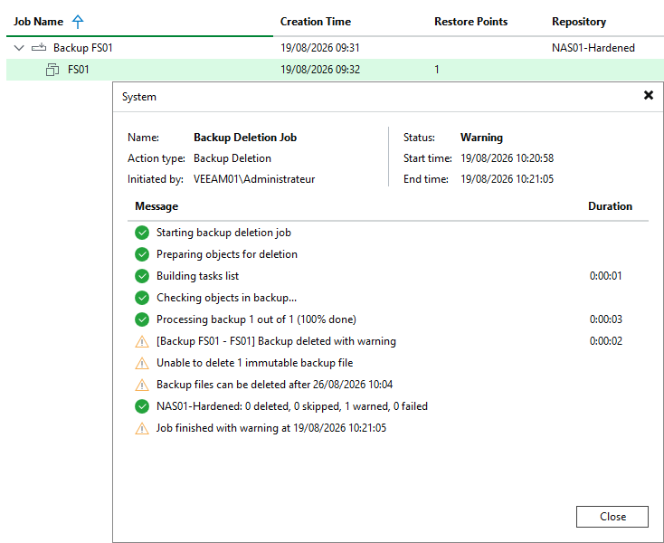

# 05 - Veeam Backup et restauration

## Objectif

Cette partie du lab consiste à mettre en œuvre la sauvegarde des machines virtuelles hébergées sur ESXI01 avec **Veeam Backup & Replication**.

Après avoir préparé le Linux Hardened Repository sur NAS01, l'objectif est maintenant de valider toute la chaîne de sauvegarde :

- connecter Veeam à l'hyperviseur ESXi ;
- détecter les machines virtuelles ;
- utiliser le repository `NAS01-Hardened` ;
- créer un job de sauvegarde pour FS01 ;
- réaliser une sauvegarde complète ;
- vérifier le fonctionnement du Changed Block Tracking ;
- supprimer volontairement un fichier métier ;
- restaurer ce fichier avec File Level Restore ;
- vérifier son retour sur FS01 ;
- tester concrètement l'immutabilité du backup.

---

# Serveur VEEAM01

Veeam Backup & Replication est installé sur un serveur Windows Server dédié.

| Paramètre | Valeur |
|---|---|
| Nom | VEEAM01 |
| Système | Windows Server 2022 |
| Adresse IP | 192.168.100.120 |
| Domaine | WORKGROUP |
| Rôle | Serveur de sauvegarde |
| Logiciel | Veeam Backup & Replication Community Edition |

VEEAM01 n'est pas hébergé dans ESXI01.

Il fonctionne directement dans VMware Workstation Pro, au même niveau que NAS01.

La logique est donc :

```text
VMware Workstation Pro
│
├── ESXI01
│   ├── FW01
│   ├── DC01
│   ├── FS01
│   └── CLT-W10-01
│
├── VEEAM01
│
└── NAS01
```

Cette séparation permet au serveur Veeam de rester disponible même en cas de perte complète de l'hyperviseur ESXi.

---

# Chaîne de sauvegarde

Le fonctionnement général peut être représenté ainsi :

```text
FS01
  │
  │ Machine virtuelle
  ▼
ESXI01
192.168.110.10
  │
  │ API VMware
  ▼
VEEAM01
192.168.100.120
  │
  │ Transfert des données
  ▼
NAS01-Hardened
192.168.100.130
  │
  ▼
/data/veeam
  │
  ▼
XFS
  │
  ▼
Backup immutable
```

VEEAM01 joue donc le rôle d'orchestrateur tandis que les données de sauvegarde sont stockées sur NAS01.

---

# Validation de la connectivité

Avant l'ajout des différents composants dans Veeam, la connectivité réseau a été vérifiée depuis VEEAM01.

## NAS01

La communication SSH initialement nécessaire au déploiement du repository a été testée avec :

```powershell
Test-NetConnection 192.168.100.130 -Port 22
```

Résultat :

```text
TcpTestSucceeded : True
```

Cette connexion n'était nécessaire que pendant le déploiement initial du Hardened Repository.

SSH a ensuite été désactivé sur NAS01 comme décrit dans la partie précédente.

---

## ESXI01

La connectivité HTTPS avec l'interface de gestion ESXi a également été contrôlée :

```powershell
Test-NetConnection 192.168.110.10 -Port 443
```

Résultat :

```text
TcpTestSucceeded : True
```

Le serveur Veeam peut donc communiquer avec l'API VMware utilisée pour administrer les sauvegardes des machines virtuelles.

---

# Ajout d'ESXI01 dans Veeam

L'hyperviseur a été ajouté dans l'infrastructure Veeam avec son adresse de management :

```text
192.168.110.10
```

Après enregistrement, Veeam détecte les machines virtuelles présentes sur l'hyperviseur :

```text
ESXI01
│
├── FW01
├── DC01
├── FS01
└── CLT-W10-01
```

### Validation de l'inventaire ESXi

Après l'ajout de l'hyperviseur, les machines virtuelles hébergées sur ESXI01 sont visibles directement dans l'inventaire Veeam :



Veeam identifie correctement `FW01`, `DC01`, `FS01` et `CLT-W10-01` ainsi que leurs systèmes invités.

L'hyperviseur est donc correctement intégré à l'infrastructure de sauvegarde.

Veeam peut ainsi sélectionner directement les machines virtuelles à protéger.

---

# Repository de destination

Le repository utilisé pour les sauvegardes est celui préparé dans la partie précédente :

```text
NAS01-Hardened
```

Il repose sur :

```text
NAS01
└── /data/veeam
    └── XFS
```

Les principales protections sont :

| Fonction | Configuration |
|---|---|
| Type | Linux Hardened Repository |
| Chemin | `/data/veeam` |
| Système de fichiers | XFS |
| Fast Clone | Activé |
| Immutabilité | 7 jours |
| Tâches simultanées | 2 |

Les fichiers de sauvegarde sont donc stockés indépendamment d'ESXI01.

---

# Création du job FS01

Un premier job a été créé afin de protéger le serveur de fichiers :

```text
FS01
```

FS01 est particulièrement intéressant pour ce test car il contient les données métier utilisées précédemment :

```text
D:\Partages
│
├── Direction
├── RH
├── Ventes
└── Informatique
```

Le job utilise comme destination :

```text
NAS01-Hardened
```

La chaîne obtenue est donc :

```text
FS01
   ↓
ESXI01
   ↓
VEEAM01
   ↓
NAS01-Hardened
   ↓
/data/veeam
```

---

# Première sauvegarde de FS01

Le job a été exécuté afin de créer une première sauvegarde complète de la machine virtuelle.

L'exécution s'est terminée avec le statut :

```text
Success
```

Les statistiques observées lors de cette sauvegarde étaient approximativement :

| Indicateur | Valeur |
|---|---:|
| Données traitées | 14,7 Go |
| Données lues | 11 Go |
| Données transférées | 6,7 Go |
| Ratio | 1,6x |
| Débit de traitement | 153 MB/s |
| Durée | environ 2 min 39 s |
| Résultat | Success |

La quantité de données réellement transférée est inférieure au volume logique traité grâce aux mécanismes de réduction et d'optimisation utilisés pendant le backup.

### Validation du job de sauvegarde

L'exécution du job `Backup FS01` s'est terminée avec succès :



La session confirme notamment :

- `14,7 GB` de données traitées ;
- `11 GB` de données lues ;
- `6,7 GB` transférés ;
- un débit de traitement de `153 MB/s` ;
- une durée totale de `02:39` ;
- l'activation du **Changed Block Tracking** ;
- `1 VM processed successfully`.

Le repository utilisé est `NAS01-Hardened`.

---

# Changed Block Tracking

Veeam utilise le **Changed Block Tracking**, ou CBT, proposé par VMware.

Le principe est de permettre à l'hyperviseur d'indiquer quels blocs d'une machine virtuelle ont changé depuis la sauvegarde précédente.

Sans CBT :

```text
Disque virtuel
      ↓
Analyse d'une grande partie du disque
      ↓
Recherche des données modifiées
```

Avec CBT :

```text
Disque virtuel
      ↓
Liste des blocs modifiés
      ↓
Lecture ciblée
      ↓
Backup incrémental
```

Cela permet de réduire les lectures inutiles lors des sauvegardes suivantes.

Le CBT a été activé pour FS01 lors de la sauvegarde.

---

# Validation du backup

Après exécution du job, FS01 apparaît dans les sauvegardes disponibles.

Le restore point permet alors différentes opérations :

```text
Backup FS01
│
├── Entire VM Restore
├── Virtual Disk Restore
├── File Level Restore
└── autres modes de restauration
```

Pour cette première validation, le choix a été fait de tester une **restauration granulaire d'un fichier**.

---

# Scénario de File Level Restore

Le fichier choisi pour le test se trouve sur le partage RH :

```text
\\FS01\RH\employes.xlsx
```

Sur FS01, son emplacement réel est :

```text
D:\Partages\RH\employes.xlsx
```

L'objectif est de simuler une suppression accidentelle réalisée par un utilisateur.

---

# Suppression volontaire du fichier

Avant la suppression, le partage RH contient notamment :

```text
RH
├── employes.xlsx
└── Procédures.txt
```

Le fichier :

```text
employes.xlsx
```

a ensuite été volontairement supprimé.

Le partage ne contient alors plus que :

```text
RH
└── Procédures.txt
```

Cette situation représente un cas classique de restauration :

```text
Utilisateur
    ↓
Suppression accidentelle
    ↓
Fichier absent de FS01
    ↓
Besoin de restauration
```

---

# File Level Restore

Depuis Veeam Backup & Replication, le restore point de FS01 a été ouvert avec le mode de restauration de fichiers Windows.

Veeam monte temporairement le contenu de la sauvegarde et ouvre le **Veeam Backup Browser**.

L'arborescence sauvegardée peut alors être parcourue jusqu'à :

```text
D:
└── Partages
    └── RH
        ├── employes.xlsx
        └── Procédures.txt
```

Le fichier supprimé du serveur de production est donc toujours présent dans le restore point.

---

# Restauration vers l'emplacement d'origine

Le fichier :

```text
employes.xlsx
```

a été sélectionné dans Veeam Backup Browser.

La restauration a été effectuée vers son emplacement d'origine :

```text
D:\Partages\RH\employes.xlsx
```

Veeam a utilisé les mécanismes d'interaction avec le système invité pour replacer le fichier sur FS01.

Lors de cette opération, des identifiants disposant des droits nécessaires sur FS01 ont été fournis à Veeam.

---

# Résultat de la restauration

La restauration s'est terminée avec succès.

Le résultat observé était :

| Paramètre | Valeur |
|---|---|
| Fichiers restaurés | 1 |
| Taille | environ 8,1 KB |
| Durée | environ 16 secondes |
| Erreurs | 0 |
| Destination | `D:\Partages\RH\employes.xlsx` |

Le fichier a donc été replacé directement dans son dossier d'origine.

### Validation du File Level Restore

Le résultat de la restauration est visible directement dans Veeam Backup Browser :



Le restore point contient bien le fichier `employes.xlsx` dans :

```text
D:\Partages\RH
```

Veeam confirme ensuite :

```text
Files to restore : 1
Restored files   : 1
Success          : 1
Errors           : 0
```

La restauration a été réalisée via la **vSphere Guest Interaction API** et s'est terminée en environ 16 secondes.

Le fichier `D:\Partages\RH\employes.xlsx` a donc bien été replacé sur FS01.

---

# Validation côté utilisateur

Le partage RH peut ensuite être contrôlé depuis un poste client :

```text
\\FS01\RH
```

ou par le lecteur réseau automatiquement mappé :

```text
S:
```

Le fichier :

```text
employes.xlsx
```

est de nouveau disponible.

La chaîne complète de restauration est donc validée :

```text
Suppression
    ↓
Fichier absent de FS01
    ↓
Sélection du restore point
    ↓
Veeam Backup Browser
    ↓
Restauration
    ↓
FS01
    ↓
\\FS01\RH\employes.xlsx
    ↓
Fichier de nouveau accessible
```

---

# Test de l'immutabilité

Après avoir validé le File Level Restore, l'immutabilité configurée sur le Hardened Repository a également été testée.

L'objectif est cette fois de vérifier qu'un backup encore protégé ne peut pas être supprimé prématurément.

Le repository utilise :

```text
7 jours d'immutabilité
```

---

# Tentative de suppression du backup

Depuis Veeam Backup & Replication, une suppression physique du backup a été demandée avec :

```text
Delete from disk
```

Veeam a refusé la suppression du fichier encore protégé.

Le message indique notamment :

```text
Unable to delete 1 immutable backup file
```

et précise la date à partir de laquelle le fichier pourra être supprimé.

Cela démontre que le backup ne peut pas être effacé normalement avant l'expiration de sa période d'immutabilité.

### Validation de l'immutabilité

Une tentative de suppression physique du backup a été effectuée depuis Veeam avec l'action `Delete from disk`.



Veeam refuse la suppression et retourne notamment :

```text
Unable to delete 1 immutable backup file
```

La session indique également :

```text
0 deleted
```

et précise la date à partir de laquelle le fichier pourra être supprimé.

Cette vérification confirme que l'immutabilité configurée sur `NAS01-Hardened` est réellement appliquée aux fichiers de sauvegarde.

---

# Intérêt de cette protection

Sans immutabilité :

```text
Compte Veeam compromis
        ↓
Suppression des backups
        ↓
Perte potentielle des possibilités de restauration
```

Avec le Hardened Repository :

```text
Compte Veeam compromis
        ↓
Tentative de suppression
        ↓
Backup immutable
        ↓
Suppression refusée
        ↓
Restore point conservé
```

L'immutabilité introduit donc une protection supplémentaire entre le serveur de sauvegarde et les fichiers stockés sur NAS01.

Elle ne remplace pas une stratégie de sauvegarde complète, mais réduit fortement le risque qu'une suppression logique depuis Veeam détruise immédiatement les restore points protégés.

---

# Validation de la chaîne complète

À ce stade, plusieurs mécanismes ont été testés concrètement.

```text
                  ESXI01
                     │
                     ▼
                    FS01
                     │
                     │ Backup
                     ▼
                  VEEAM01
                     │
                     ▼
              NAS01-Hardened
                     │
                     ▼
                 XFS /data
                     │
                     ▼
              Backup immutable
                     │
          ┌──────────┴──────────┐
          │                     │
          ▼                     ▼
 File Level Restore      Suppression backup
          │                     │
          ▼                     ▼
 employes.xlsx          Refusée pendant
 restauré               l'immutabilité
```

La chaîne n'a donc pas uniquement été configurée : elle a été testée à la fois en **sauvegarde**, en **restauration** et en **protection contre la suppression**.

---

# Validation finale

À l'issue de cette partie :

- VEEAM01 fonctionne comme serveur de sauvegarde indépendant d'ESXI01 ;
- VEEAM01 communique avec l'interface de management d'ESXI01 ;
- les machines virtuelles de l'hyperviseur sont visibles dans Veeam ;
- `NAS01-Hardened` est utilisé comme destination ;
- FS01 dispose d'un job de sauvegarde dédié ;
- une sauvegarde complète de FS01 a été réalisée avec succès ;
- le Changed Block Tracking est actif ;
- les données sont stockées sur le repository XFS de NAS01 ;
- le fichier `employes.xlsx` a été volontairement supprimé ;
- le fichier était toujours disponible dans le restore point ;
- un File Level Restore a été effectué ;
- le fichier a été restauré à son emplacement d'origine ;
- la restauration s'est terminée sans erreur ;
- le fichier est redevenu accessible depuis le partage RH ;
- une tentative de suppression d'un backup immutable a été réalisée ;
- Veeam a refusé la suppression avant la fin de la période de protection.

La sauvegarde et la restauration granulaire sont donc opérationnelles.

La prochaine étape consiste à aller plus loin en simulant non plus la perte d'un fichier, mais la **perte complète du serveur FS01**.

---

## Suite

La prochaine partie simule un scénario de sinistre avec suppression complète de FS01 puis restauration de l'intégralité de la machine virtuelle :

➡️ [06 - Disaster Recovery](06-disaster-recovery.md)
