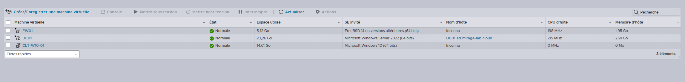
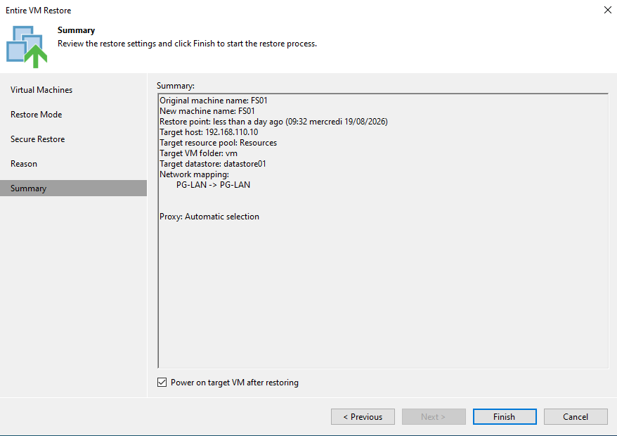
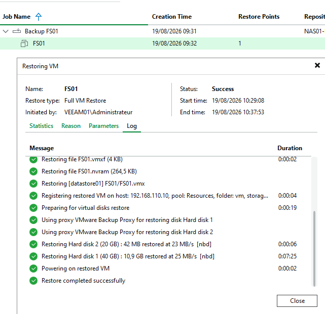
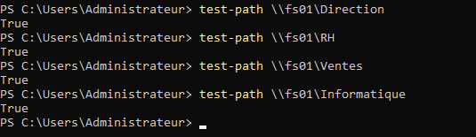
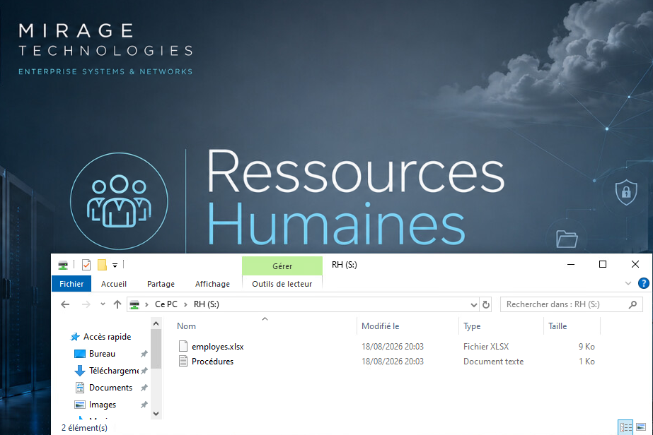

# 06 - Disaster Recovery

## Objectif

Cette dernière partie du lab consiste à valider un scénario de **Disaster Recovery** sur le serveur de fichiers FS01.

Les étapes précédentes ont permis de vérifier :

- la sauvegarde de FS01 avec Veeam ;
- le stockage des backups sur `NAS01-Hardened` ;
- la restauration granulaire d'un fichier ;
- l'immutabilité des sauvegardes.

L'objectif est maintenant de simuler un incident beaucoup plus important :

```text
Perte complète de FS01
```

puis de vérifier qu'il est possible de restaurer l'intégralité de la machine virtuelle à partir du backup.

Le scénario doit permettre de retrouver :

- la machine virtuelle FS01 ;
- son système Windows Server 2022 Core ;
- sa configuration réseau ;
- son appartenance au domaine ;
- son disque de données ;
- les partages SMB ;
- les permissions NTFS ;
- les données métier ;
- le fonctionnement des lecteurs réseau côté utilisateur.

---

## Scénario de sinistre

Le serveur concerné est :

| Paramètre | Valeur |
|---|---|
| Serveur | FS01 |
| Système | Windows Server 2022 Core |
| Adresse IP | 10.10.10.20 |
| Domaine | ad.mirage-lab.cloud |
| Rôle | Serveur de fichiers |
| Hyperviseur | ESXI01 |
| Repository de sauvegarde | NAS01-Hardened |

FS01 contient les ressources utilisées dans le reste du lab :

```text
D:\Partages
│
├── Direction
├── RH
├── Ventes
├── Informatique
└── Ressources
```

La perte de cette machine entraîne donc l'indisponibilité des différents partages métier.

---

## Situation avant le sinistre

Avant de simuler la perte de FS01, une sauvegarde valide de la machine est disponible dans Veeam.

La chaîne de protection peut être représentée ainsi :

```text
ESXI01
   │
   └── FS01
         │
         │ Backup orchestré par VEEAM01
         ▼
    NAS01-Hardened
         │
         ▼
    /data/veeam
         │
         ▼
    Restore point FS01
```

VEEAM01 orchestre les opérations de sauvegarde tandis que les fichiers de backup sont stockés sur `NAS01-Hardened`.

Le repository étant hébergé en dehors d'ESXI01, la sauvegarde reste disponible même si la machine virtuelle de production disparaît.

---

## Simulation de la perte de FS01

La machine virtuelle FS01 a été volontairement supprimée de l'environnement ESXi afin de simuler une perte complète du serveur.

La situation devient :

```text
ESXI01
│
├── FW01
├── DC01
├── CLT-W10-01
└── FS01
    ✗
```

Les autres VM d'ESXI01 restent présentes et l'infrastructure de sauvegarde VEEAM01/NAS01-Hardened demeure disponible en dehors de l'hyperviseur protégé.

La sauvegarde de FS01 n'étant pas stockée sur ESXI01, elle reste exploitable depuis Veeam.

### Validation de la perte de FS01

Après suppression de la machine virtuelle, l'inventaire ESXi ne contient plus FS01 :



Les machines `FW01`, `DC01` et `CLT-W10-01` restent présentes, tandis que `FS01` a disparu de l'hyperviseur.

Le scénario simule donc bien une perte complète de la machine virtuelle du serveur de fichiers.

---

## Impact de la perte du serveur

Sans FS01, les ressources suivantes deviennent indisponibles :

```text
\\FS01\Direction
\\FS01\RH
\\FS01\Ventes
\\FS01\Informatique
```

Les lecteurs réseau utilisateurs qui pointent vers ces partages ne peuvent donc plus accéder aux données.

La logique du sinistre est :

```text
Utilisateur
    │
    ▼
Lecteur S:
    │
    ▼
\\FS01\Service
    │
    ▼
FS01 indisponible
    │
    ▼
Accès aux données impossible
```

L'objectif du Disaster Recovery est de rétablir cette chaîne.

---

## Choix du mode de restauration

Dans Veeam Backup & Replication, le backup de FS01 reste disponible malgré l'absence de la machine virtuelle originale.

Pour ce scénario, le mode utilisé est :

```text
Entire VM Restore
```

Contrairement au File Level Restore utilisé précédemment, cette opération ne restaure pas un fichier isolé.

Elle permet de restaurer la **machine virtuelle complète** à partir du restore point.

La logique devient :

```text
Restore point FS01
        │
        ▼
Entire VM Restore
        │
        ▼
ESXI01
        │
        ▼
FS01 restauré
```

---

## Restauration de la machine virtuelle

Le restore point de FS01 a été sélectionné dans Veeam.

L'objectif est de replacer la machine virtuelle dans l'environnement ESXi afin de retrouver le serveur tel qu'il était au moment de la sauvegarde.

La source de restauration est :

```text
NAS01-Hardened
```

avec les fichiers de sauvegarde stockés sous :

```text
/data/veeam
```

La destination est l'hyperviseur :

```text
ESXI01
```

### Paramètres de restauration

Avant le lancement de l'opération, Veeam affiche un résumé de la restauration :



La configuration confirme notamment :

```text
Original machine name : FS01
New machine name      : FS01
Target host           : 192.168.110.10
Target datastore      : datastore01
Network mapping       : PG-LAN -> PG-LAN
```

L'option permettant de remettre automatiquement la machine sous tension après la restauration est également activée.

Veeam utilise les données présentes dans le repository afin de reconstruire la machine virtuelle.

---

## Chaîne de restauration

Le flux logique peut être représenté ainsi :

```text
NAS01-Hardened
192.168.100.130
        │
        │ Restore point FS01
        ▼
VEEAM01
192.168.100.120
        │
        │ Orchestration de la restauration
        ▼
ESXI01
192.168.110.10
        │
        ▼
FS01
10.10.10.20
```

Cette architecture permet de restaurer une machine hébergée sur ESXI01 à partir d'une infrastructure de sauvegarde indépendante.

### Validation du Full VM Restore

La restauration complète de FS01 s'est terminée avec succès :



Veeam confirme notamment :

```text
Restore type : Full VM Restore
Status       : Success
```

La session montre également la restauration des deux disques virtuels de FS01, l'enregistrement de la machine sur ESXI01 puis sa remise sous tension.

L'opération se termine avec :

```text
Restore completed successfully
```

---

## Vérification des ressources SMB

Après restauration de FS01, l'accessibilité des quatre principaux partages métier a été contrôlée avec PowerShell :

```powershell
Test-Path \\FS01\Direction
Test-Path \\FS01\RH
Test-Path \\FS01\Ventes
Test-Path \\FS01\Informatique
```



Les quatre commandes retournent `True`, confirmant que les ressources SMB sont de nouveau accessibles.

| Partage | Résultat |
|---|---|
| `\\FS01\Direction` | True |
| `\\FS01\RH` | True |
| `\\FS01\Ventes` | True |
| `\\FS01\Informatique` | True |

La restauration complète de la machine virtuelle a donc permis de remettre en service les quatre principaux partages SMB de FS01.

---

## Vérification des données

La restauration de la machine virtuelle doit également permettre de retrouver le contenu du disque de données.

Par exemple, le dossier RH contient de nouveau :

```text
RH
├── employes.xlsx
└── Procédures.txt
```

Les autres espaces métier sont également disponibles :

```text
Direction
RH
Ventes
Informatique
```

La restauration ne permet donc pas seulement de récupérer le système d'exploitation : elle restitue également le disque contenant les données du serveur de fichiers.

---

## Validation depuis une session utilisateur

Une validation fonctionnelle a également été réalisée depuis une session utilisateur du domaine appartenant au service RH.



Le lecteur réseau `RH (S:)` est de nouveau disponible et pointe vers :

```text
\\FS01\RH
```

L'utilisateur retrouve notamment :

```text
employes.xlsx
Procédures.txt
```

Cette validation confirme que la restauration ne s'est pas limitée au retour de la machine virtuelle : les ressources sont de nouveau accessibles depuis une véritable session utilisateur du domaine.

Cette vérification valide donc le retour fonctionnel du service et pas uniquement le démarrage de la machine virtuelle.

---

## Chaîne fonctionnelle après restauration

Après le Disaster Recovery, la chaîne complète est de nouveau opérationnelle :

```text
Utilisateur RH
      │
      ▼
Active Directory
      │
      ▼
GG_RH
      │
      ▼
DL_RH_Modification
      │
      ▼
GPO lecteur réseau
      │
      ▼
S:
      │
      ▼
\\FS01\RH
      │
      ▼
D:\Partages\RH
      │
      ▼
employes.xlsx
Procédures.txt
```

Les mécanismes configurés dans les étapes précédentes continuent donc de fonctionner après la restauration complète de FS01.

---

## Du File Level Restore au Disaster Recovery

Deux niveaux de restauration ont maintenant été testés dans le lab.

| Scénario | Solution utilisée |
|---|---|
| Suppression d'un fichier | File Level Restore |
| Perte complète de FS01 | Entire VM Restore |

Le File Level Restore permet de restaurer un élément précis sans reconstruire l'intégralité de la machine virtuelle.

L'Entire VM Restore est utilisé lorsque la machine elle-même doit être restaurée.

Cela permet de choisir une méthode de restauration proportionnée à l'incident rencontré.

---

## Séparation de l'infrastructure de sauvegarde

Le scénario valide concrètement le choix architectural présenté précédemment : VEEAM01 et NAS01-Hardened ne sont pas hébergés dans ESXI01.

La suppression de FS01 n'a donc pas entraîné la perte de son restore point, qui est resté accessible depuis l'infrastructure de sauvegarde.

Cette séparation reste logique et non physique, puisque l'ensemble du lab repose sur un même hôte VMware Workstation Pro, comme précisé dans les limites du projet.

---

## Du backup à la reprise après sinistre

Le projet ne valide donc pas uniquement la création d'un fichier de sauvegarde.

La chaîne testée est :

```text
Infrastructure de production
          │
          ▼
       Backup FS01
          │
          ▼
Linux Hardened Repository
          │
          ▼
      Immutabilité
          │
          ▼
Simulation d'un sinistre
          │
          ▼
Entire VM Restore
          │
          ▼
Retour de FS01
          │
          ▼
Validation des partages
          │
          ▼
Validation utilisateur
```

Le backup devient réellement utile lorsqu'il est possible de démontrer qu'il permet de remettre un service en fonctionnement après un incident.

---

## Validation finale

À l'issue du scénario de Disaster Recovery :

- une sauvegarde valide de FS01 était disponible sur `NAS01-Hardened` ;
- FS01 a été volontairement supprimé de l'environnement ESXi ;
- le restore point est resté disponible ;
- une restauration complète a été effectuée avec `Entire VM Restore` ;
- FS01 a retrouvé son système et son disque de données ;
- les quatre partages métier sont redevenus accessibles ;
- les données ont été conservées ;
- le lecteur réseau `S:` fonctionne de nouveau côté utilisateur ;
- le contenu du partage RH est de nouveau accessible.

Le scénario démontre donc qu'une perte complète du serveur de fichiers peut être suivie d'une restauration fonctionnelle depuis l'infrastructure Veeam.

---

## Conclusion du lab

L'ensemble du projet permet de valider une chaîne complète d'administration et de protection d'une petite infrastructure d'entreprise :

```text
Virtualisation
     │
     ▼
Segmentation réseau
     │
     ▼
Active Directory
     │
     ▼
AGDLP
     │
     ▼
Serveur de fichiers
     │
     ▼
Permissions NTFS / SMB
     │
     ▼
GPO
     │
     ▼
Veeam Backup
     │
     ▼
Linux Hardened Repository
     │
     ▼
Immutabilité
     │
     ▼
File Level Restore
     │
     ▼
Disaster Recovery
```

Le lab ne se limite donc pas au déploiement de services : les mécanismes mis en place ont été **testés jusqu'à la restauration réelle des données et d'une machine virtuelle complète**.

Cela permet de couvrir à la fois l'administration systèmes, l'infrastructure réseau, Active Directory, la gestion des permissions, la sauvegarde, le durcissement et la restauration après sinistre.

---

## Retour

⬅️ [05 - Veeam Backup et restauration](05-veeam-backup-restore.md)
